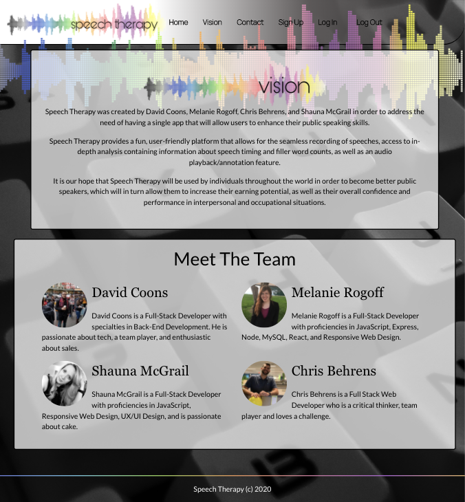
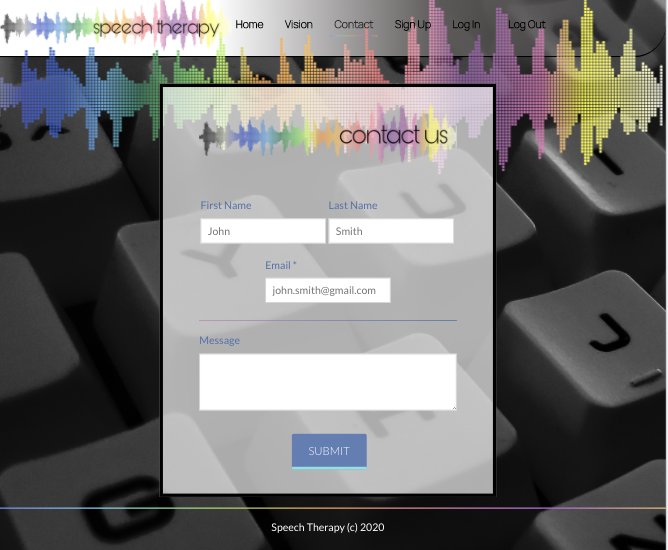
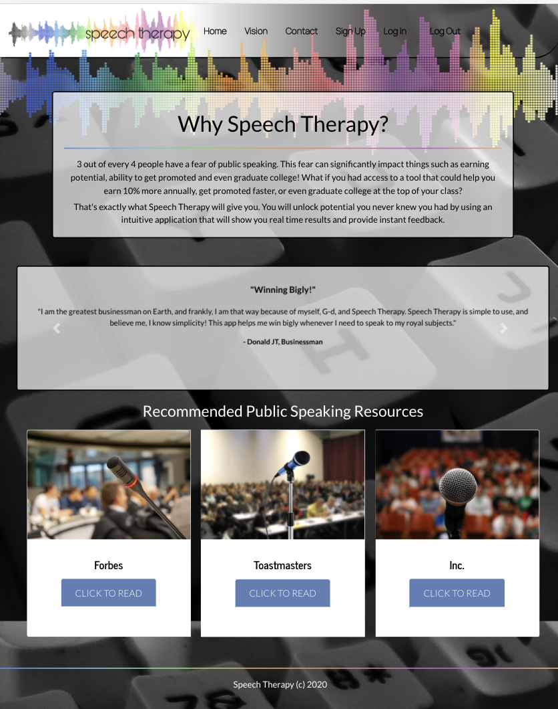
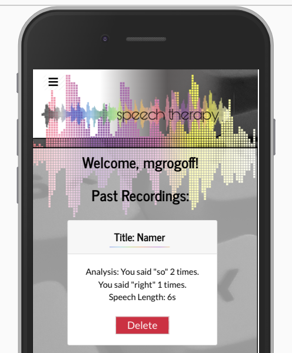
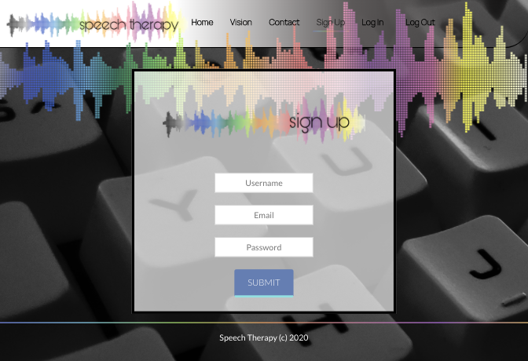
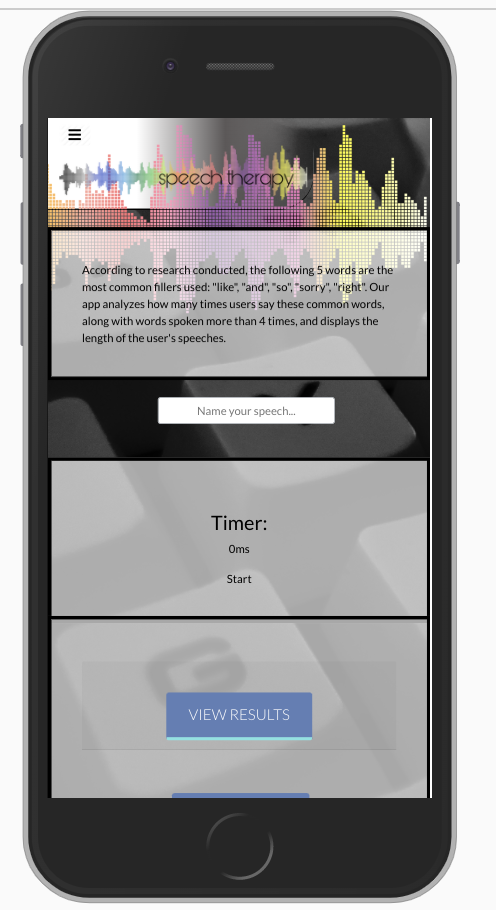

Speech Therapy is a web app created by David Coons, Melanie Rogoff, Chris Behrens, and Shauna McGrail. 

Speech Therapy enables users to improve upon and gain confidence in their public speaking skills, which will allow them to handle interpersonal and occupational situations with ease. 

**Features**: Audio recording technology, speech length analytics, filler word analytics, three recommended public speaking articles to read in tandem with utilization of the app, ability to access saved speech analytics after creating an account. 

**Technologies Utilized:** React, MySQL/Sequelize, Nodemailer, Express, Node, Bootstrap 4, HTML5, CSS3, Sass, WebSpeech API, Passport, Heroku.

**Deployed Link:** https://speechtherapyapp.herokuapp.com/

**Screenshots**:

